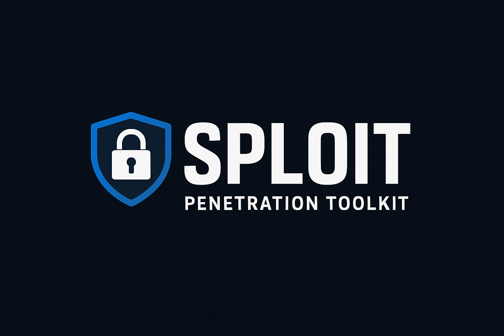
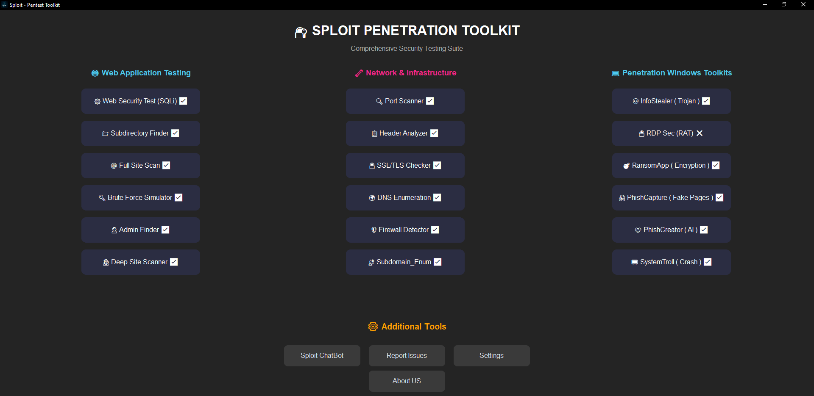

# SecuSploitX - Advanced Offensive Security & Penetration Testing Suite



> **All-in-One Cybersecurity & AI Offensive Toolkit**  
> By the AUX-441 Team | Red Team, Blue Team, AI Security, and More  
> Modular · Cross-Platform · Community-Driven · Inspired by Industry Leaders

---

<div align="center">


*Graphical User Interface (GUI)*


*Terminal / CLI Mode*

</div>

---

## 🚩 About SecuSploitX

**SecuSploitX** is a next-generation, open-source, modular, and extensible penetration testing and cyber defense suite.  
Inspired by the world’s top tools (Metasploit, Nmap, Burp Suite), SecuSploitX takes security automation to the next level with:

- **Web & Network Security Modules**
- **Phishing & Social Engineering Simulators**
- **AI-based Automation, Chatbots, and Content Generators**
- **GUI & CLI Modes for Every User**
- **Cross-platform Support:** Windows, Linux, macOS, Android (via Termux)
- **Dockerized Deployments for Hassle-Free Usage**
- **Extensive Documentation & Community Support**

> **Legal Disclaimer:**  
> This tool is for educational, research, and authorized professional use only.  
> **Unauthorized use is illegal and strictly forbidden.**

---

## 🧑‍💻 About Us & Contributors

SecuSploitX is built by a talented, multidisciplinary team:

### **Core Team & Roles**

- **Joel**  
  *Lead UI Designer & Visual Planner*  
  Designs and implements all graphical elements, user flows, and ensures SecuSploitX's GUI is both intuitive and visually compelling ،
Cybersecurity analyst, Blue Team , Security Operations Analyst .

- **Tara**  
  *Lead Developer & Technical Assistant*  
  Backend logic, module integration, and technical troubleshooting. Bridges AI, network code, and usability for smooth operation.

- **Fatheme**  
  *AI & Core Developer, Project Lead*  
  Creator of SecuSploitX's AI modules and architect of offensive/defensive logic for penetration testing and automation. Manages releases and documentation.

- **aux / AUX-441**  
  *Main Programmer, Security Researcher, Project Lead*  
  Advanced cybersecurity modules, exploits, real-world attack/defense code, new feature development, and public project presentation.

#### **Special Thanks & Open Source Contributors**

- [mynameismama6zaa (GitHub)](https://github.com/mynameismama6zaa)
- [Jcyber-protect (GitHub)](https://github.com/Jcyber-protect)
- [FAtheme (GitHub)](https://github.com/FAtheme)
- [AUX-441 (GitHub)](https://github.com/AUX-441) _(Project Lead)_

We appreciate all testers, issue reporters, and those who help build a safer world.  
Want to join? [See Contributing Guidelines](CONTRIBUTING.md)

---

## 🏆 Key Features

---

### 🌐 Web Security

- 🛡️ **SQL Injection Scanner**  
  Automated SQLi detection with advanced payload fuzzing and error fingerprinting.

- 🗂️ **Subdirectory Finder**  
  Uncovers hidden directories/admin paths using powerful wordlists.

- 🔎 **Deep Site Scanner**  
  Comprehensive crawling & vulnerability analysis for web assets.

- 🪜 **Brute Force Simulator**  
  Intelligent, adaptive username/password brute force with real-time feedback.

- 🔐 **Admin/Login Finder**  
  Locates concealed admin/login panels with next-gen heuristics.

- 🧾 **Header Analyzer**  
  Detects HTTP header misconfigurations & missing security headers.

- 🔑 **SSL/TLS Checker**  
  Validates certificates, expiry, chain, and supported ciphers.

- 🧱 **Firewall Detector**  
  Identifies WAFs, firewalls, and advanced defensive mechanisms.

- 🎭 **Phishing AI**  
  AI-powered phishing email/page/content generator & training simulator.

---

### 🌐🔗 Network & Infrastructure

- 🚀 **Port Scanner**  
  Lightning-fast, multi-threaded scan (top 100/1000/custom ports).

- 🌐 **DNS Enumeration**  
  Discover all DNS records: A, AAAA, MX, NS, TXT, CNAME, SOA, PTR, SRV.

- 🏷️ **Subdomain Finder**  
  Massive concurrent subdomain enumeration with customizable wordlists.

---

### 🪟 Windows Offensive (GUI)

- 🕵️‍♂️ **InfoStealer Builder** *(GUI only)*  
  Customizable info-stealer generator for research and defense simulation.

- 🖥️ **RDP Sec (RAT)** *(GUI only)*  
  RAT simulator for blue team defense and training labs.

- 💣 **RansomApp** *(GUI only)*  
  In-depth ransomware simulation lab for testing and research.

- 🌀 **SystemTroll** *(GUI only)*  
  System crash/test simulator for resilience and defense scenarios.

---

### 🤖 AI & Automation

- 🤖 **SecuSploitX Chatbot**  
  ML/AI-powered assistant for security Q&A and module guidance.

- 🧠 **PhishCreator AI**  
  Generates realistic phishing scenarios/content with machine learning.

---

### 🎣 Phishing Modules

- 🕹️ **Steam Phishing Generator**  
  Create advanced, customizable phishing pages targeting Steam authentication flows for awareness and simulation.

- 📸 **Instagram Phishing Generator**  
  Simulate Instagram login attacks for training, with realistic UI and anti-detection features.

- 📷 **Camera Capture Phishing**  
  Deploy phishing pages that request or simulate camera access to demonstrate real-world attack scenarios (safety/consent features included).

- 📍 **Location Capture Phishing**  
  Simulate phishing pages or payloads designed to request geolocation data from targets, for demonstrating the risks of location leaks.

> ⚠️ **For educational, research, and authorized testing only. All modules include warnings and ethical disclaimers.**

---

### 📊 General

- 📝 **Logging & Reporting**  
  Detailed, exportable logs, reports, and output files for every module.

---

> 💡 **Fully modular:**  
> Add or customize modules and scripts with ease.  
> See [Wiki/Modules](https://github.com/AUX-441/SecuSploitX/wiki/Modules) for a full list!

---

## 📦 Installation & Quick Start

SecuSploitX supports all major operating systems and runs on Python 3.13+.  
**Choose your preferred deployment method:**

---

### 🐧 Linux & macOS

#### 1. Clone the repository

```bash
git clone https://github.com/AUX-441/SecuSploitX.git
cd SecuSploitX
```
#### 2. Install Python dependencies

```bash
python3 -m venv venv
source venv/bin/activate    # For Linux / macOS
pip install --upgrade pip
pip install -r requirements.txt
```
#### 3. Run SecuSploitX (Terminal/CLI)
```bash
python main.py
```
#### 4. Run SecuSploitX (GUI)
```bash
python GUI/Application.py
```
> **Tip:** For macOS, you may need `python3` instead of `python`.

---

### 📱 Android (Termux)

SecuSploitX works fully in [Termux](https://termux.dev/)!

#### 1. Install Termux & Python

```bash
pkg update && pkg upgrade
pkg install python git
```
#### 2. Clone SecuSploitX

```bash
git clone https://github.com/AUX-441/SecuSploitX.git
cd SecuSploitX
```
#### 3. Install dependencies

```bash
pip install --upgrade pip
pip install -r requirements.txt
```
#### 4. Run SecuSploitX (Terminal Mode)

```bash
python main.py
```
> *GUI mode is not supported in Termux due to X11 limitations.*

---

### 🪟 Windows

#### 1. Install [Python 3.13+](https://www.python.org/downloads/)

#### 2. Clone the repository

```powershell
git clone https://github.com/AUX-441/SecuSploitX.git
cd SecuSploitX
```

#### 3. Install dependencies

```powershell
python -m pip install --upgrade pip
python -m pip install -r requirements.txt
```

#### 4. Run SecuSploitX (Terminal or GUI)

```powershell
python main.py
# or
python GUI\Application.py
```

---

### 🐳 Docker (Universal, Zero-Conflict)

#### **Why Use Docker?**
- Zero system dependency hassle
- Reproducible environment for teams and CI/CD pipelines
- Full isolation and easy removal

#### 1. Install [Docker](https://docs.docker.com/get-docker/) for your OS

#### 2. Build the Docker Image

```bash
cd SecuSploitX
docker build -t secusploitx .
```

#### 3. Run SecuSploitX (Terminal/CLI)

```bash
docker run -it --rm secusploitx
```

#### 4. Run SecuSploitX (GUI mode, X11 on Linux)

```bash
docker run -it --rm -e DISPLAY=$DISPLAY -v /tmp/.X11-unix:/tmp/.X11-unix secusploitx python GUI/Application.py
```
> For Docker GUI usage on Windows/Mac: [See Wiki for X11/GUI details](https://github.com/AUX-441/SecuSploitX/wiki/Docker-GUI)

#### **Dockerfile Example:**
```Dockerfile
FROM python:3.13.3-slim

ENV PYTHONUNBUFFERED=1 \
    PYTHONDONTWRITEBYTECODE=1

RUN apt-get update && apt-get install -y \
    build-essential \
    libgl1 \
    libglib2.0-0 \
    portaudio19-dev \
    && rm -rf /var/lib/apt/lists/*

WORKDIR /app

COPY requirements.txt .
COPY . .

RUN pip install --upgrade pip \
    && pip install -r requirements.txt

EXPOSE 5000

CMD ["python", "main.py"]
```

---

## 🛠️ Usage

SecuSploitX is designed to be intuitive for both beginners and pros.

### Terminal Mode

- **Interactive Menu:** All modules accessible, step-by-step configuration prompts
- **Output:** Results printed and saved in `/output` folder

### GUI Mode

- **Modern, User-Friendly Interface**
- **Visual Reports:** Easy interpretation, export as HTML/PDF
- **Advanced Modules:** (InfoStealer, RAT, RansomApp, SystemTroll) GUI only

### Sample Workflows

#### **SQL Injection Test (Terminal)**

```bash
python main.py
# Select: Web Security Test (SQLi)
# Enter target URL (e.g. https://target.com/login)
```

#### **Port Scan (CLI)**

```bash
python main.py
# Select: Port Scanner
# Enter target host (e.g. example.com)
# Choose scan type (top 1000, all, or custom)
```

#### **Deep Scan & Export (GUI)**

1. Run: `python GUI/Application.py`
2. Click "Deep Site Scanner"
3. Enter target, configure, and export report

> See [Wiki/Modules](https://github.com/AUX-441/SecuSploitX/wiki/Modules) for detailed usage of every module.

---

## 📚 Documentation & Help

- **[Wiki & Usage Guide](https://github.com/AUX-441/SecuSploitX/wiki)**
- **[Module Reference](https://github.com/AUX-441/SecuSploitX/wiki/Modules)**
- **[FAQ](https://github.com/AUX-441/SecuSploitX/discussions/categories/q-a)**
- **[Issue Tracker](https://github.com/AUX-441/SecuSploitX/issues)**
- **[Discussions & Community](https://github.com/AUX-441/SecuSploitX/discussions)**

---

## 🔐 Security Policy & Reporting

- Please report vulnerabilities and sensitive security issues privately.
- **Security issues, bug reports, and all confidential communications should be sent directly to:**  
  📧 **submindf@gmail.com**
- See [SECURITY.md](SECURITY.md) for full disclosure and reporting information.
- **Absolutely no illegal use is permitted.**

---

## 🤝 Contributing

- Fork the repository and create your feature/fix branch.
- Follow [CONTRIBUTING.md](CONTRIBUTING.md) for code style and PR requirements.
- Submit detailed PRs with documentation.
- Join the community for support, feedback, and collaboration!

---

## 🌟 Credits & Acknowledgments

**SecuSploitX** is the result of passion, expertise, and open-source spirit.  
Special thanks to:

- **Joel** – UI/UX Design, Branding  
- **Tara** – Core Coding, Integration, Documentation  
- **AUX** – AI, Security, Project Management  
- **Fatheme** – Programming, Research  
- [mynameismama6zaa](https://github.com/mynameismama6zaa) – Community Support  
- [Jcyber-protect](https://github.com/Jcyber-protect) – Development, QA  
- [FAtheme](https://github.com/FAtheme) – Module Testing  
- [AUX-441](https://github.com/AUX-441) – Project Lead

And all contributors at [GitHub Contributors](https://github.com/AUX-441/SecuSploitX/graphs/contributors)

---

## 🏷️ Tags & SEO Topics

`penetration-testing` `offensive-security` `ethical-hacking` `cybersecurity` `ai-security` `web-security` `network-security` `redteam` `blueteam` `python` `security-automation` `metasploit-alternative` `docker` `termux` `cross-platform` `security-toolkit`

---

## ⚖️ License

**© AUX-441 Team**  
Licensed under [CC BY-NC-ND 4.0](LICENSE)  
No commercial use, copy, or redistribution without written consent.

---

## 📬 Contact & Community

- [GitHub Discussions](https://github.com/AUX-441/SecuSploitX/discussions)
- [Telegram Channel](https://t.me/SecuSploitX)
- **Email for support, bug reports, and security issues:**  
  📧 **submindf@gmail.com**

---
